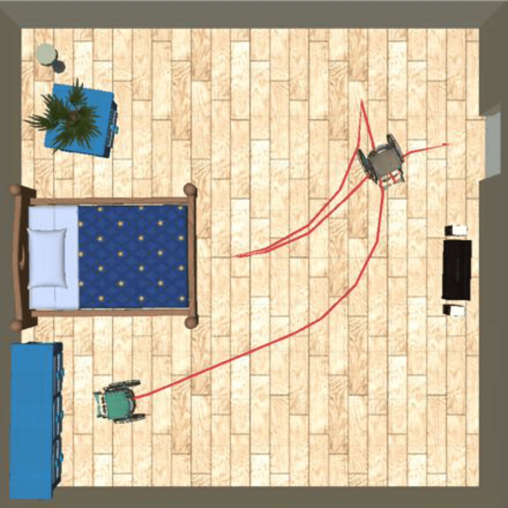

**1. Title & Authors**  
**Title:** Designing Human-Robot Coexistence Space  
**Authors:** Jixuan Zhi, Lap-Fai Yu, Jyh-Ming Lien (George Mason University)  
**Affiliations:** George Mason University  
**Contact:** jzhi@gmu.edu. zhijixuan@gmail.com

**2. Abstract**  
We propose a computational framework to optimize room layouts for human-robot coexistence, balancing human preferences and robot navigation constraints (e.g., nonholonomic wheelchair motion). Our motion planner reduces design computation time by 65–70%, enabling real-time generation of accessible layouts for bedrooms, offices, and complex L-shaped rooms.

**3. Layman’s Summary**  
Imagine redesigning your living room so both humans and robots move comfortably. Our AI acts like an interior designer for shared spaces: it arranges furniture to match your preferences while ensuring wheelchair robots can navigate efficiently. Think of it as ‘feng shui’ for human-robot harmony!

**4. Key Visuals**  
+ **Figures to Highlight:**  
  + Figure 1: Comparison of bad vs. optimized layouts for wheelchair accessibility.  
     
    > **Figure 1:** The figure on the left is a worse layout design comparing to the  design in the right figure produced by the proposed framework that considers human preferences and ensures that all the objects are accessible by the wheelchair robot entering from the door.  
  + Figure 2: Framework overview (optimization loop with motion planning).
    
    > **Figure 2:** An overview of the proposed design method. Given the room size and objects, with user-defined Action-Object relation graph, our approach generates scenes and paths that satisfy the human preferences and wheelchair motion constraints.
  + Figures 8–11: Optimized designs for bedrooms, offices, and L-shaped rooms.  
         
         
         
    > **Figure 8:** Two layout designs and a path covering three objects in each of the bedroom (top), office (mid),  and living room (bottom).  In all three examples, the wheelchair starts from the door.
    
     
    > **Figure 10:** Two different layout designs for the L-shape living room.  
  + Figure 7: Motion planning time reduction (baseline vs. proposed method).  
    
    > **Figure 7:** Path planning time using the baseline planner and the proposed planner. The planning time is 96.06% of the total running times.
+ **Infographics:**  
  + Workflow: Human preferences + robot constraints → layout optimization → accessibility paths.  
  + RS-decomposition for nonholonomic motion planning.  
          
    > **Figure 5:** Approximate partition the configuration space into different regions by RS words. Samples with the same color are a region with the shared word. There are 48 regions in total.

**5. Significance & Impact**  
+ **Key Contributions:**
  + First framework to co-optimize human preferences and robot navigation in shared spaces.
  + Ultra-fast motion planner: Reduces computation time from 10–20 minutes to 3–5 minutes.
  + Demonstrated in diverse environments (bedrooms, L-shaped rooms, offices).
+ **Applications:** Accessible home design, smart offices, rehabilitation centers.

**6. Download & Citation**  
+ **Download:** IEEE Xplore (DOI: 10.1109/LRA.2021.3097061)
  - [IEEE Version](https://ieeexplore.ieee.org/document/9484808)
  - [arXiv Version](https://arxiv.org/abs/2011.07374)
  - [Pre-Print Version](../files/Pre-HRS.pdf)
+ **Cite (IEEE):** Jixuan Zhi, Lap-Fai Yu, and Jyh-Ming Lien. "Designing human-robot coexistence space." IEEE Robotics and Automation Letters 6, no. 4 (2021): 7161-7168.  

**7. Media Kit**  
+ **Video Abstract:**
  + Before/after room layouts (e.g., cluttered vs. optimized designs).  
  + Time-lapse of motion planner generating wheelchair paths.  
  

**8. Testimonials**   
"Our planner reduces motion planning time by 65–70%, enabling real-time design optimization."

**9. Related Work & Code**  
**Following Research:** [Optimize Shared Spaces for Human-Robot Collaboration](https://jixuanzhi.github.io/publication/KitchenDesign)  
**Code/Datasets:**  Available upon request (Unity/C# implementation).  

**10. Press Coverage**  
The paper is presented at IROS 2021, Prague, Czech Republic (Online)  
[IROS 2021 Presentation Talk](https://jixuanzhi.github.io/talks/HR)

