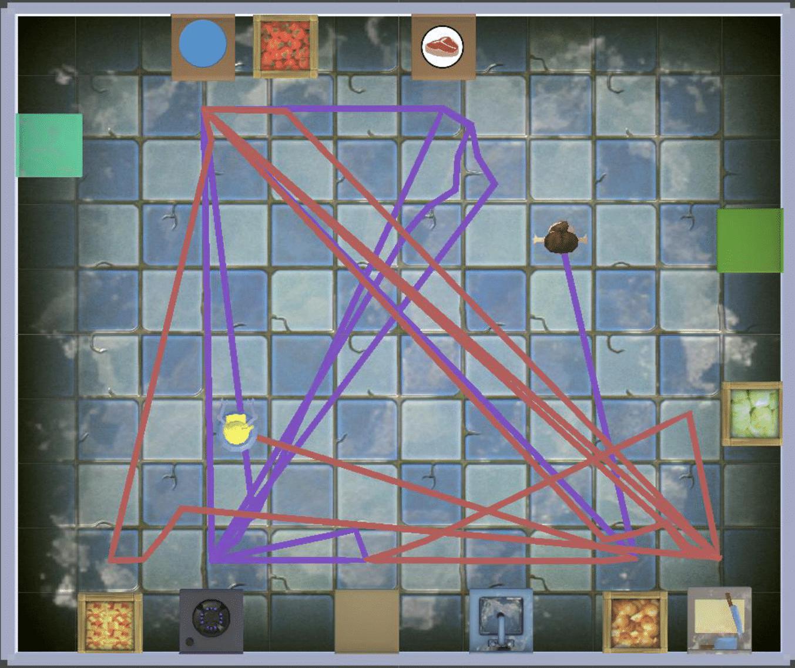
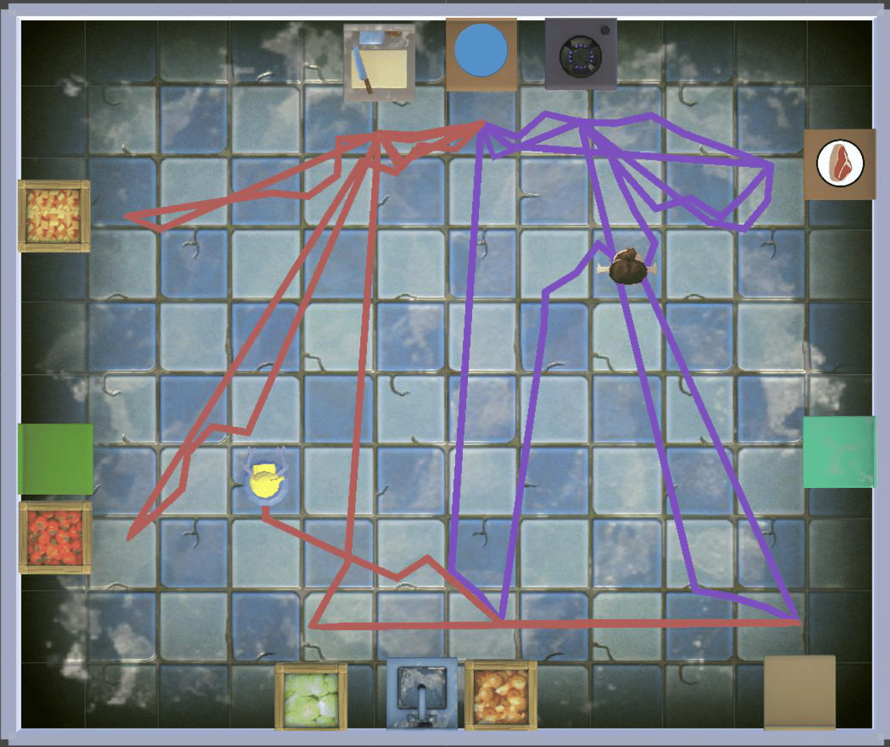
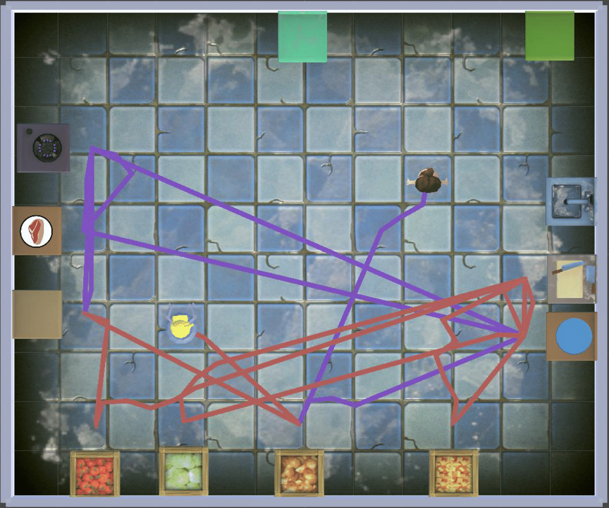
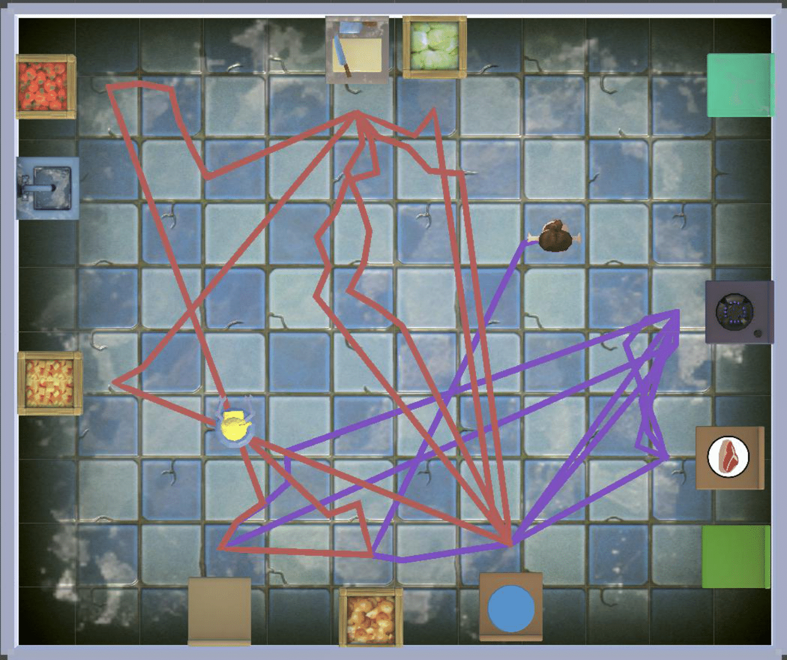
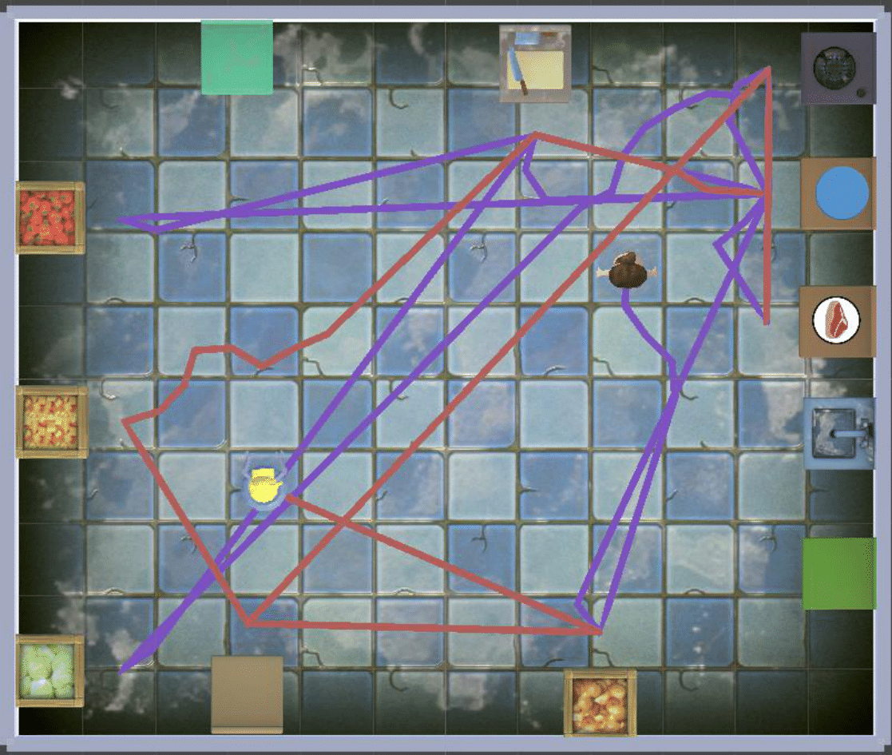
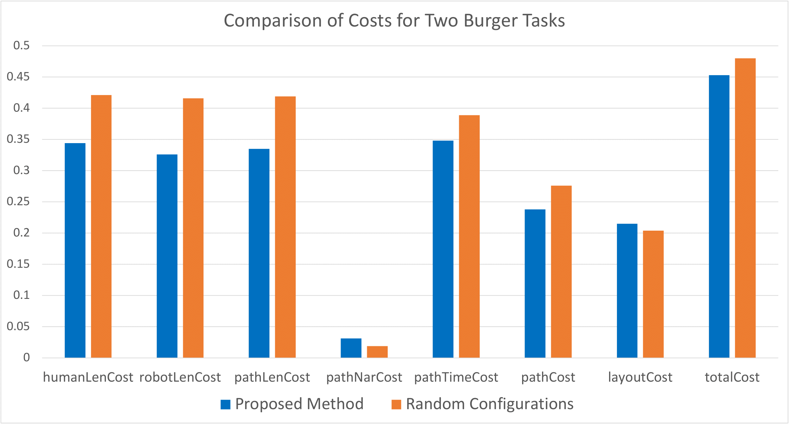
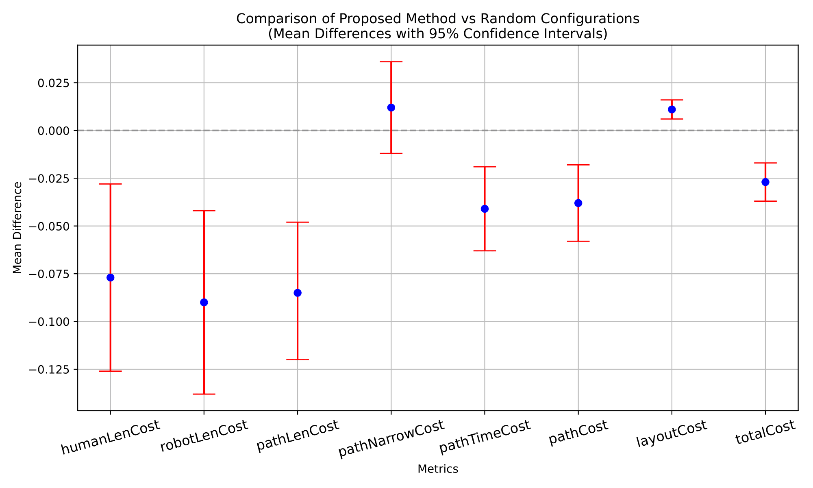
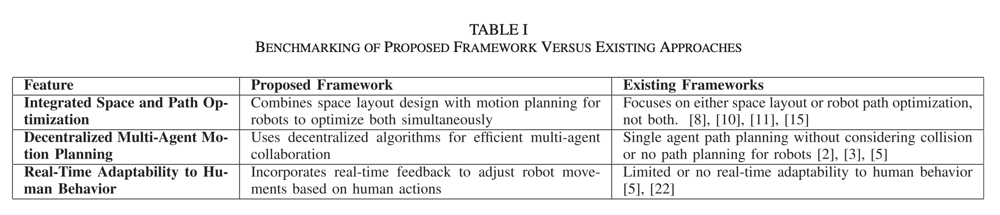
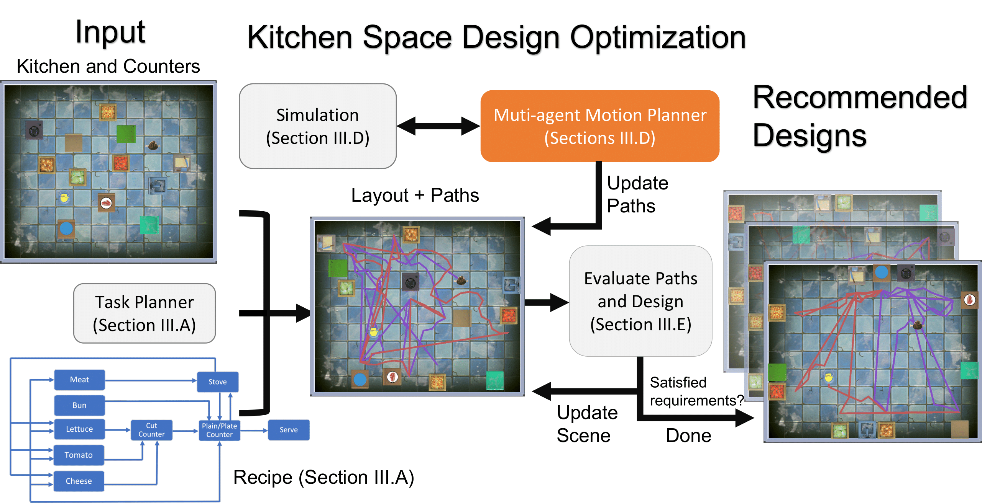
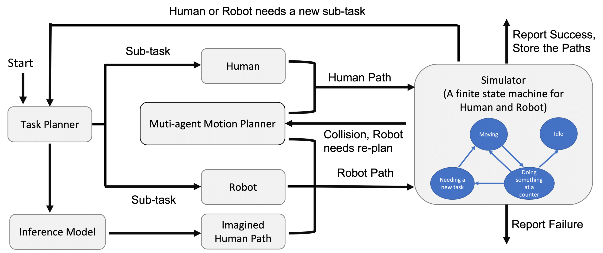

**1. Title & Authors**  
**Title:** Improving Human-Robot Collaboration via Computational Design  
**Authors:** Jixuan Zhi, Jyh-Ming Lien (George Mason University)  
**Affiliations:** George Mason University  
**Contact:** jzhi@gmu.edu, zhijixuan@gmail.com.  

**2. Abstract**  
We propose a computational framework to optimize shared spaces (e.g., kitchens) for human-robot collaboration. By integrating layout design with decentralized multi-agent motion planning, our method reduces task completion time by 20% and minimizes path conflicts. Evaluations show optimized layouts improve efficiency in diverse environments, including compact and L-shaped kitchens.  

**3. Layman’s Summary**  
Imagine redesigning your kitchen so humans and robots cook together seamlessly. Our AI acts like a teamwork architect: it arranges counters and appliances to reduce collisions and waiting time. Think of it as ‘Tetris for collaboration’—every piece (human, robot, counter) fits perfectly to boost productivity!  

**4. Key Visuals**  
+ **Figures to Highlight:**  
  + Figure 1: Comparison of inefficient vs. optimized kitchen layouts.  
     
  + Figure 6: Four optimized kitchen designs with human/robot paths.  
     
     
  + Figure 8–9: Cost comparisons across layouts (path length, narrowness, time).
    
    
  + Table I: Benchmarking against existing frameworks.
    

+ **Infographics:**  
  + Workflow: Recipe planning → multi-agent motion planning → layout optimization.
    
  + Decentralized path planning (human priority + robot adaptation).
    

**5. Significance & Impact**
+ **Key Contributions:**
  + First framework to co-optimize spatial layouts and dynamic paths for human-robot teams.  
  + 20% faster task completion and 10% shorter paths compared to random layouts.  
  + Demonstrated in kitchens, industrial settings, and complex L-shaped rooms.  
+ **Applications:** Collaborative kitchens, smart factories, healthcare logistics.  

**6. Download & Citation**  
+ **Download:** IEEE Xplore (DOI: 10.1109/LRA.2024.3519863)
  - [IEEE Version](https://ieeexplore.ieee.org/document/10806640)
  - [arXiv Version](https://arxiv.org/abs/2303.11425)
  - [Pre-Print Version](../files/to/local/file.pdf)
+ **Cite (IEEE):** Jixuan Zhi and Jyh-Ming Lien. "Improving Human-Robot Collaboration Via Computational Design." IEEE Robotics and Automation Letters 10, no. 2 (2025): 1074-1081.

**7. Media Kit**  
+ **Video Abstract:** Create a 1-minute video showing:  
  + Side-by-side cooking tasks in random vs. optimized kitchens (highlighting path efficiency).  
  + Heatmaps of human/robot movement overlap reduction.  
+ High-Res Figures: Provide Figures 1 (layout comparison) and 6 (optimized designs) for press use.  

**8. Testimonials**  
"Optimized layouts reduce human-robot path conflicts by 30% and idle time by 20%."

**9. Related Work & Code**  
+ Prior Research:  
+ Code/Datasets: Unity/C# implementation is avaliable upon request.  

**10. Press Coverage**  
In conference  
![paper] (https://ieeexplore.ieee.org/document/10806640)
