**1. Title & Authors**  
**Title:** Learning to Herd Agents Amongst Obstacles: Training Robust Shepherding Behaviors Using Deep Reinforcement Learning  
**Authors:** Jixuan Zhi, Jyh-Ming Lien (George Mason University)  
**Affiliations:** George Mason University
**Contact:** jzhi@gmu.edu  

**2. Abstract**  
We propose a deep reinforcement learning (DRL) framework combined with probabilistic roadmaps (PRM) to train a shepherding controller capable of herding agents in obstacle-cluttered environments. The learned model outperforms rule-based methods with higher success rates (70%+), shorter completion times, and reduced path lengths, even under noisy group behavior and environmental uncertainties.

**3. Layman’s Summary**  
Imagine a robot sheepdog trained by AI to herd a flock through a maze of fences. Unlike traditional methods that rely on rigid rules, our AI learns to adapt on the fly, avoiding obstacles and keeping the flock together—even when the sheep are unpredictable or the maze changes shape. This makes herding faster, more reliable, and energy-efficient!

**4. Key Visuals**  
+ **Figures to Highlight:**  
  + Figure 1: Workspace and the shepherd’s observation space (local view).
    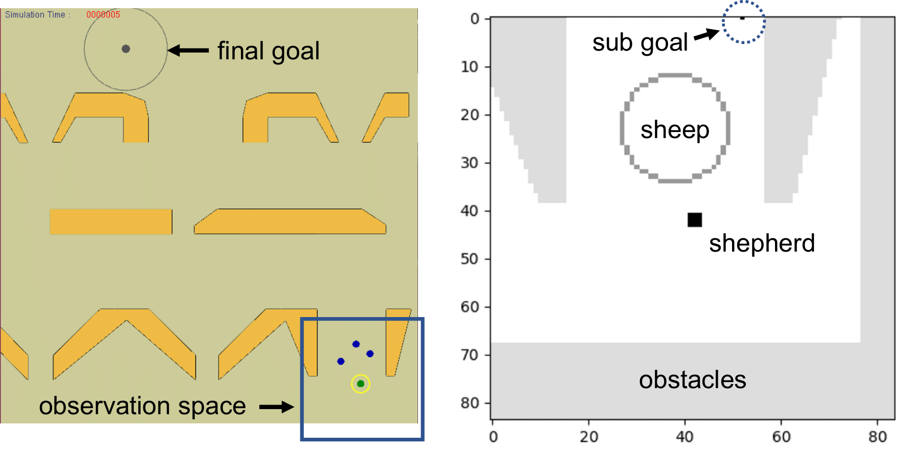
    > **Figure 1:** The global view of the workspace (left)  and the shepherd's observation space (right) in a local view.    
  + Figure 5: Paths in fixed obstacle environments ("filter" scenarios).  
    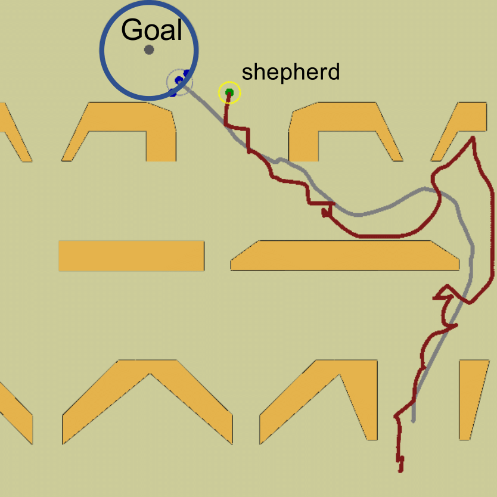 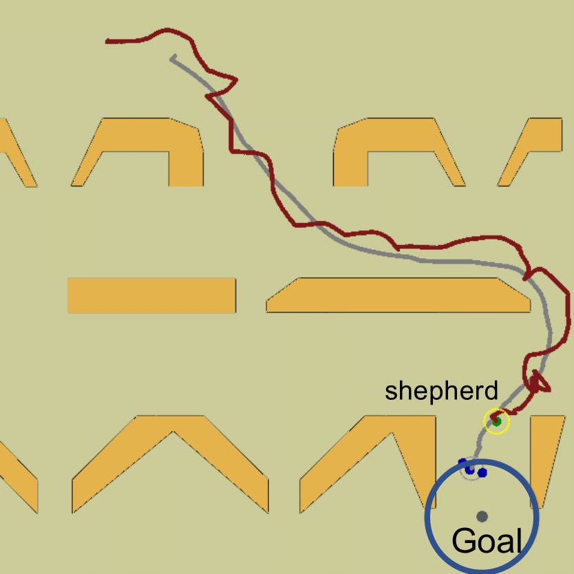
    > **Figure 5:** The fixed obstacles env. (filter env.) with shepherd (red) and sheep paths (grey) generated by the proposed method. 
    
  + Figure 6: Perturbed fence obstacles with U-turns and gaps.  
    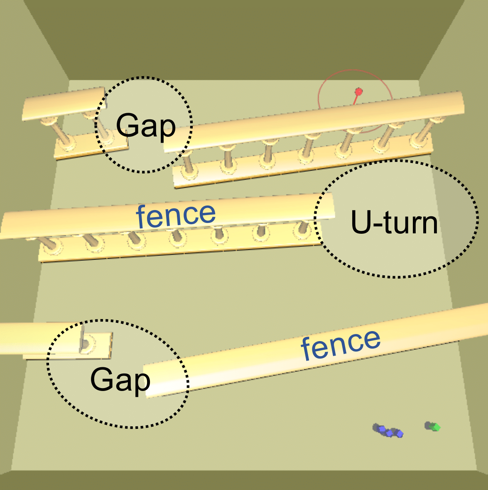 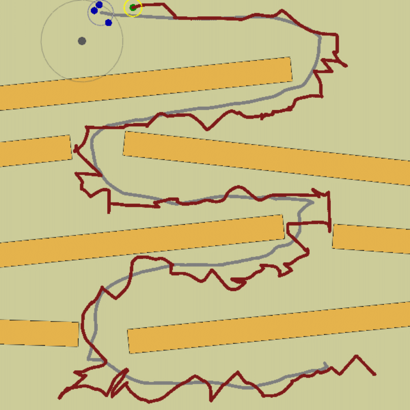
    > **Figure 6:** We perturb the positions and orientations of the fences that form three (left) or four (right) U-turns and gaps during training.    
  + Figures 7–12: Performance charts (success rates, completion time, path length).      
    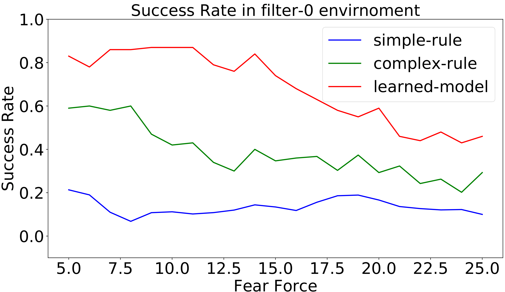 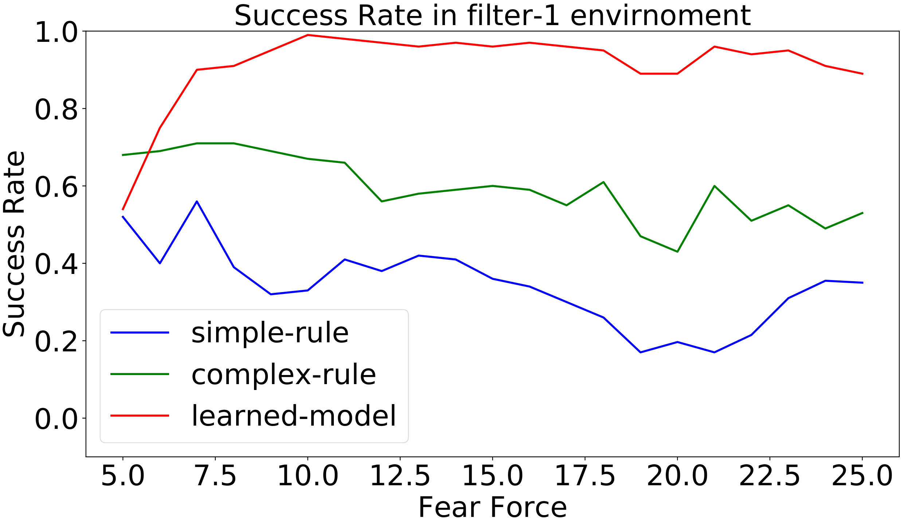  
    > **Figure 7:** Success rate in different levels of fear in the filter environment. High fear force models easily scared agents (e.g., geese) that are more difficult to control. 
The learned controller is trained with fear coefficient 15.  
    
    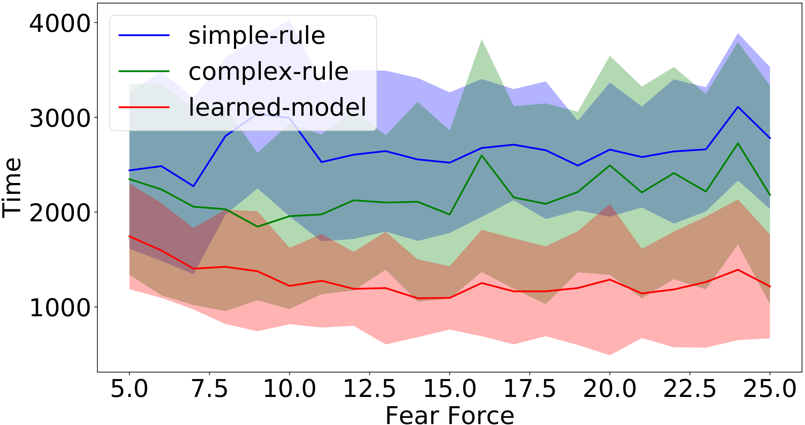 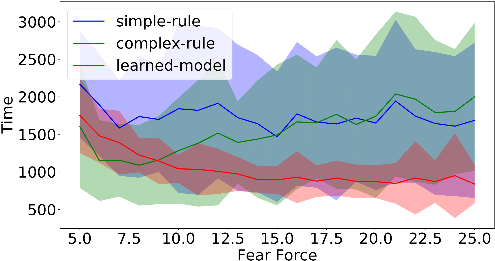  
    > **Figure 8:** Completion time (simulation steps) of the successful runs for different levels of fear coefficient in the filter-0 (left) and filter-1 environments.
    
    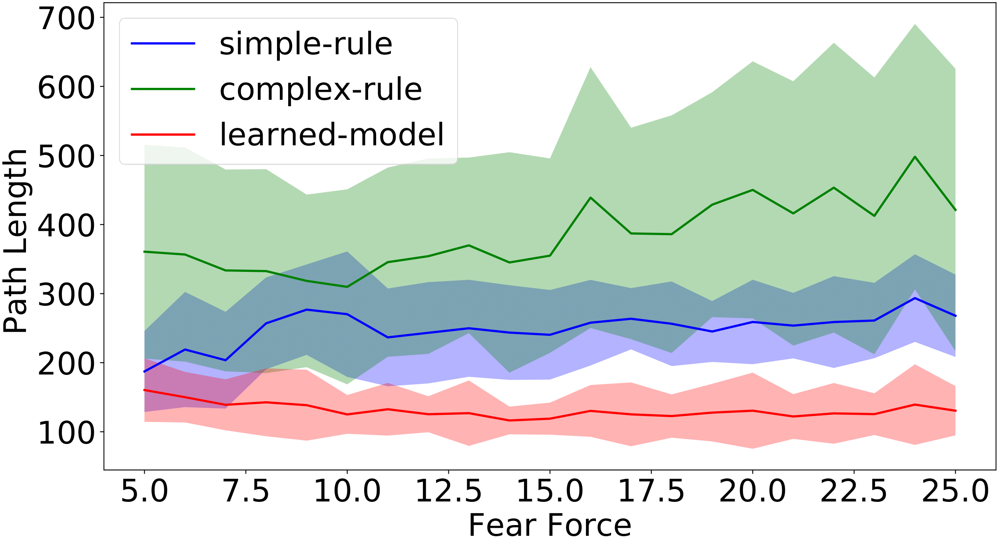 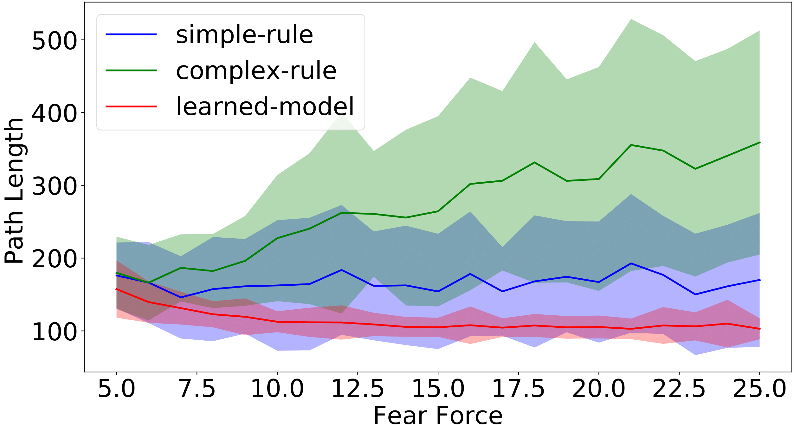  
    > **Figure 9:** Path length of the successful runs for different levels of fear coefficients in the filter-0 (left) and filter-1 environments. The unit of path length is meter in simulation. (1 meter = 5 pixels).
    
    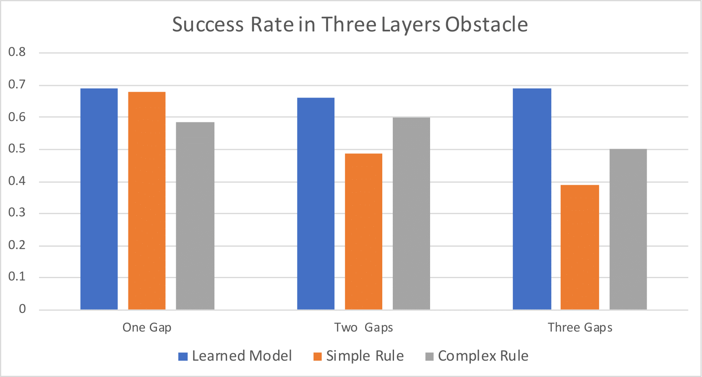 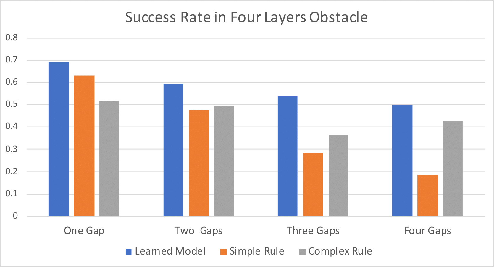  
    > **Figure 10:** Success rates in  perturbed three-layer and four-layer obstacles.
    
    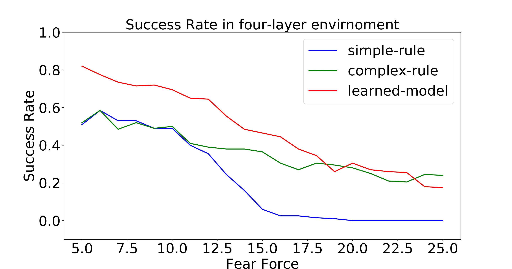
   > **Figure 11:** Success rates with varying fear in a fixed four-layer environment.  
    
    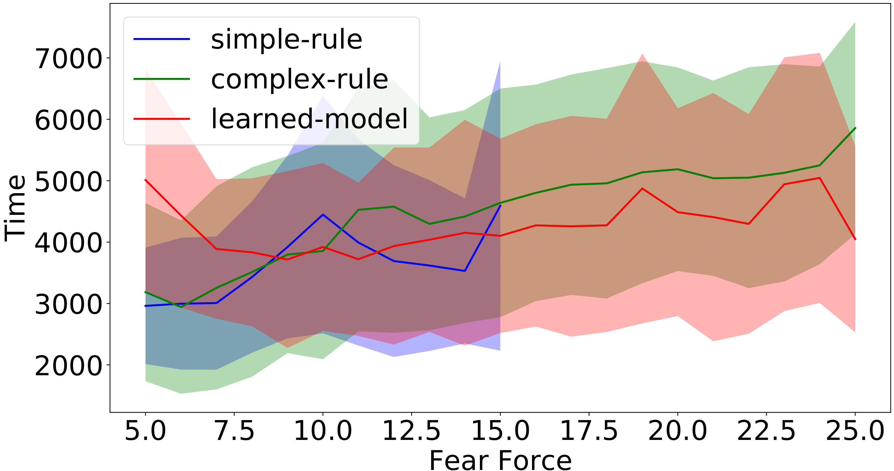 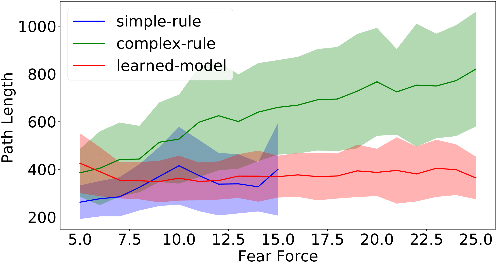  
    > **Figure 12:** Complete time (left) and path length (right) of success runs for different levels of fear force in a four-layer environment.      
  
+ **Infographics:**  
  + Workflow of DRL training (observation → action → reward).  
  + Comparison of rule-based vs. learning-based herding strategies.

**5. Significance & Impact**
+ **Key Contributions:**
  + First learning-based method to herd agents in obstacle-filled environments.
  + 15–30% higher success rates than rule-based methods in cluttered settings.
  + "Lazy" herding: 20–50% shorter path lengths, reducing energy costs.
+ **Applications:** Agriculture (livestock herding), crowd control, UAV swarm management.

**6. Download & Citation**  
+ **Download:** IEEE Xplore (DOI: 10.1109/LRA.2021.3068955)
  - [IEEE Version](https://ieeexplore.ieee.org/document/9387150)
  - [arXiv Version](https://arxiv.org/abs/2005.09476)
  - [Pre-Print Version](../files/Pre-Herd-PRM.pdf)
+ **Cite (IEEE):**  
Jixuan Zhi, and Jyh-Ming Lien. "Learning to herd agents amongst obstacles: Training robust shepherding behaviors using deep reinforcement learning." IEEE Robotics and Automation Letters 6, no. 2 (2021): 4163-4168.

**7. Media Kit**  
+ **Video Abstract:**  
  + Shepherd navigating flocks through fixed and perturbed obstacle courses.  
  + Side-by-side comparison with rule-based methods (highlighting efficiency gains).  
    

**8. Testimonials**  
"The DRL controller achieves 70% success rates in unseen 4-layer obstacle environments—15% higher than rule-based methods."

**9. Related Work & Code**  
  + Following Research: [Herding with DRL and Potential Fields](https://jixuanzhi.github.io/publication/ShepherdingwithPF) 
  + Code/Datasets: C++/Python implementation is avaliable upon request.  

**10. Press Coverage**    
The paper is presented at ICRA 2021, Xi'an, China (Online).  
[ICRA 2021 Presentation Talk](https://jixuanzhi.github.io/talks/DRL)

