**1. Title & Authors**  
**Title:** Learning to Herd Amongst Obstacles from an Optimized Surrogate  
**Authors:** Jixuan Zhi, Jyh-Ming Lien (George Mason University)  
**Affiliations:** George Mason University 
**Contact:** jzhi@gmu.edu, zhijixuan@gmail.com

**2. Abstract**  
We propose a deep reinforcement learning (DRL) framework guided by an optimized potential field surrogate to herd large groups (7–8 agents) in obstacle-cluttered environments. Our pixel-blob group representation and surrogate-driven training achieve 65–85% success rates, outperforming rule-based methods. The approach is robust to behavioral noise and environmental uncertainty, with 10–20% higher success rates than prior learning-based methods.

**3. Layman’s Summary**  
Imagine a robot sheepdog trained by AI to herd a large flock through a maze. Instead of rigid rules, the robot uses an invisible ‘force field’ to guide sheep smoothly around obstacles. Even if the flock scatters or the maze changes, the AI adapts, keeping the herd together and moving efficiently!

**4. Key Visuals**  
+ **Figures to Highlight:**  
  + Figure 1: Overview of the optimized potential field and pixel-blob group representation.  
    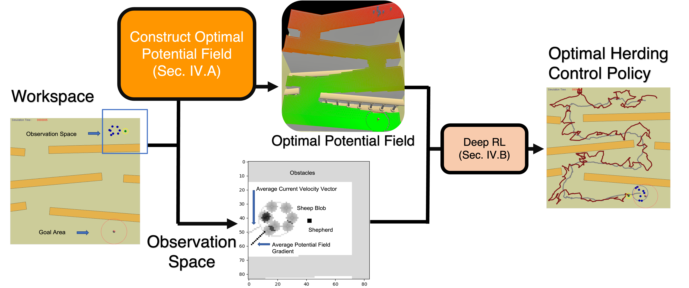
  + Figure 3–4: Fixed (lattice, pachinko) and perturbed (U-turn, gap) obstacle environments.  
     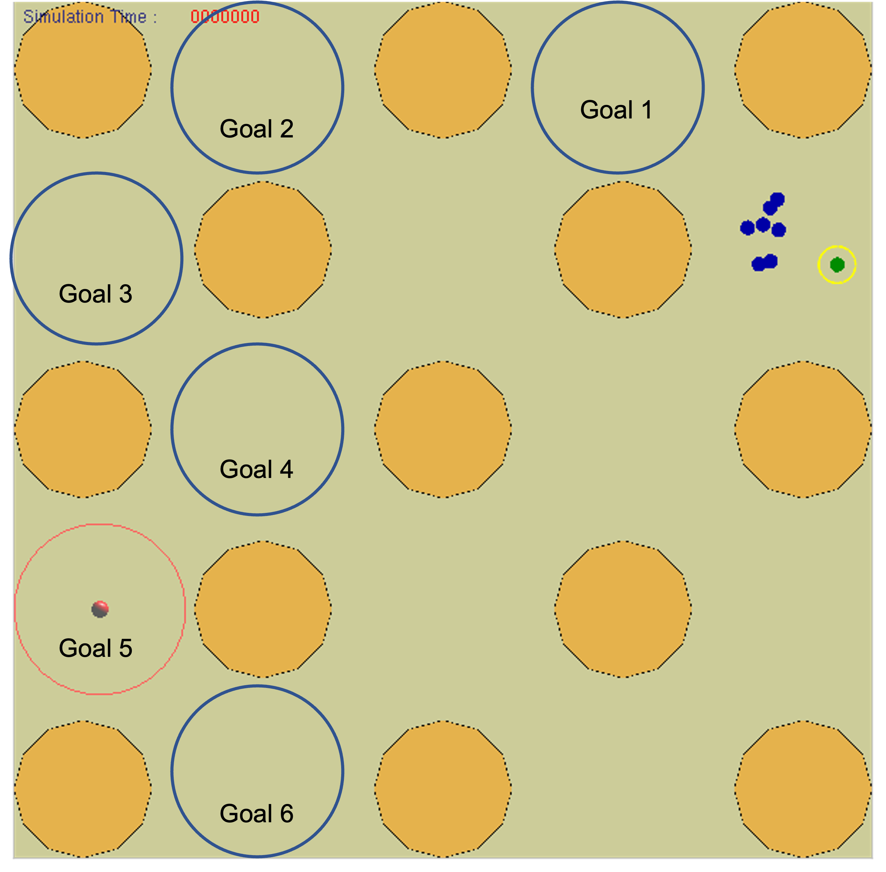  
    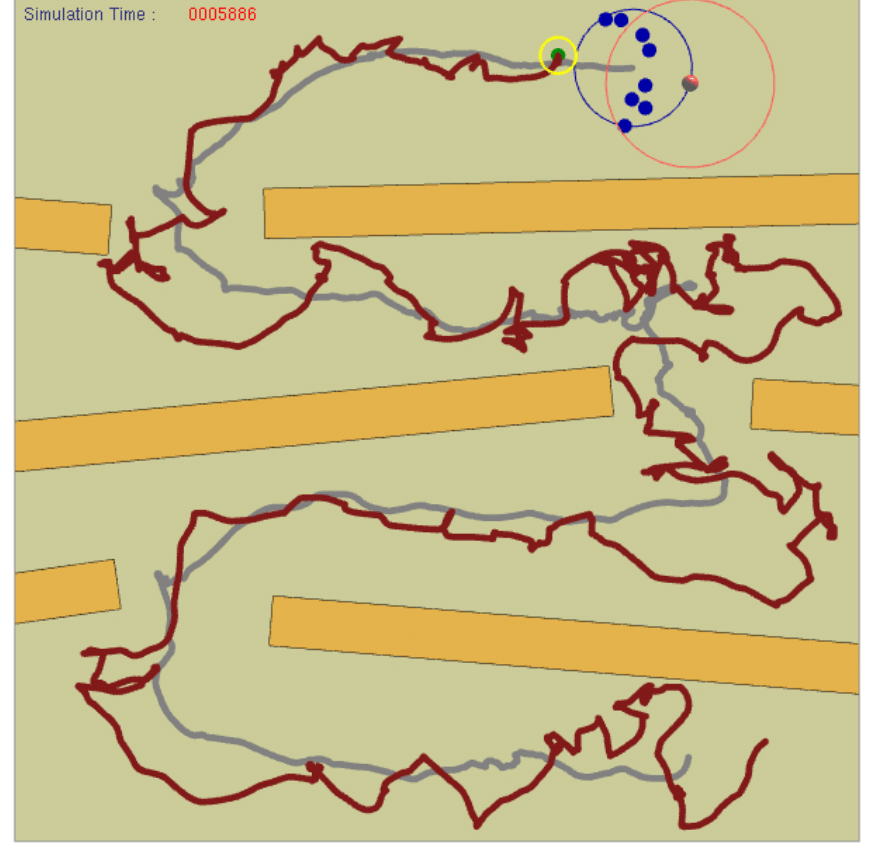 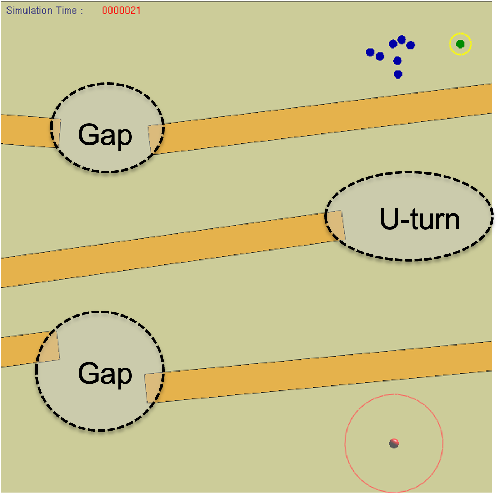  
  + Figures 5–10: Performance charts (success rates, completion time, energy cost).  
    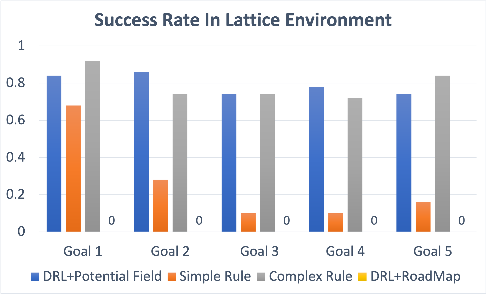 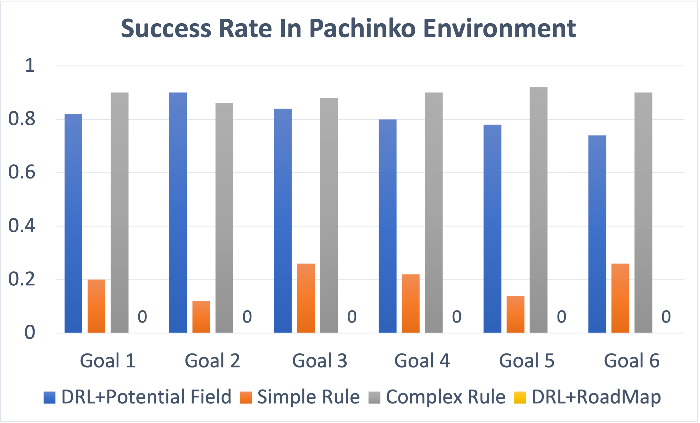  
    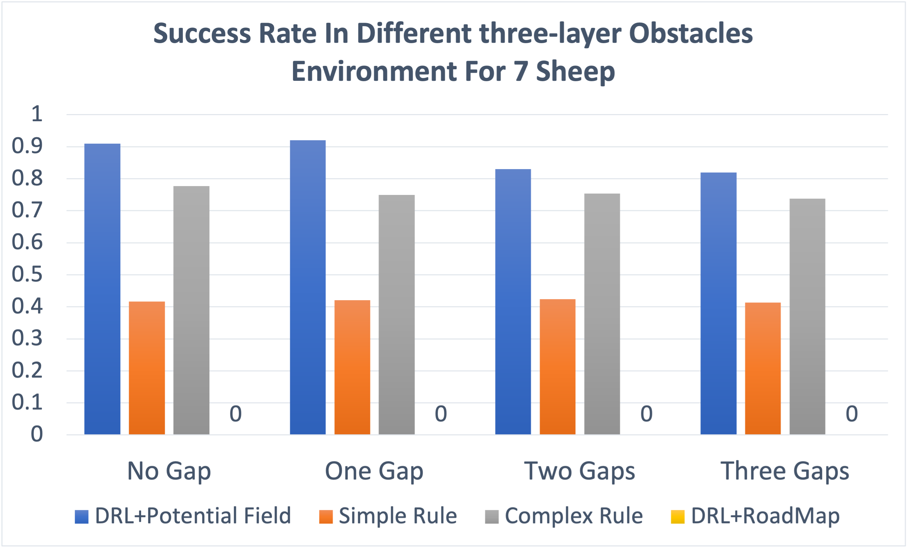 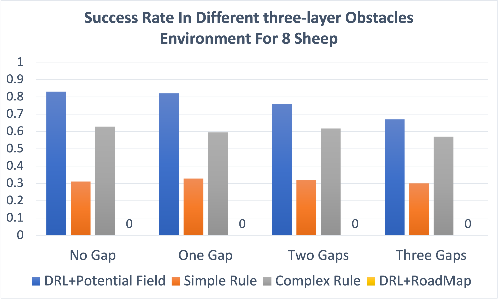
    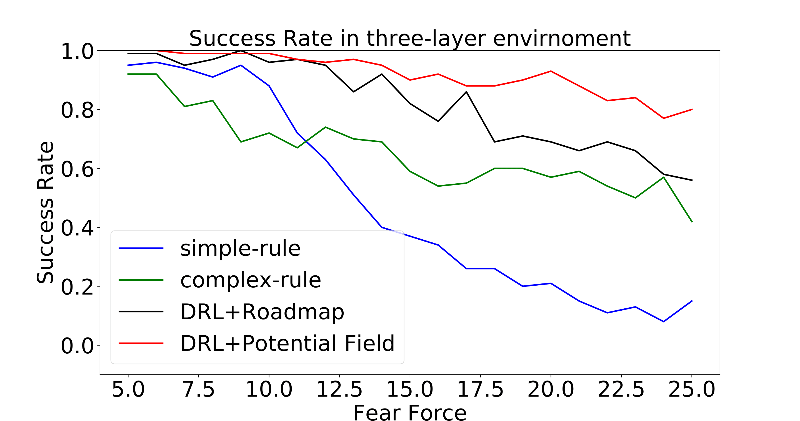  
    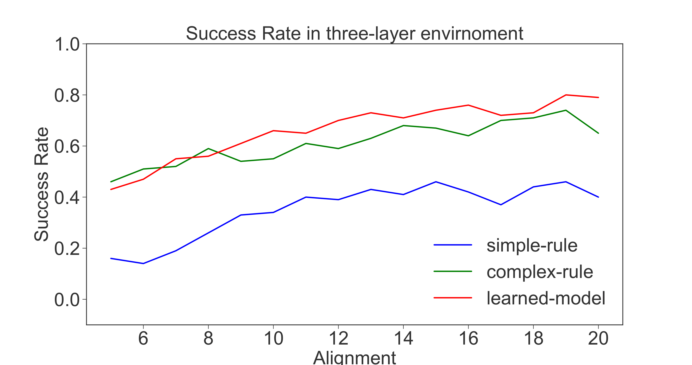 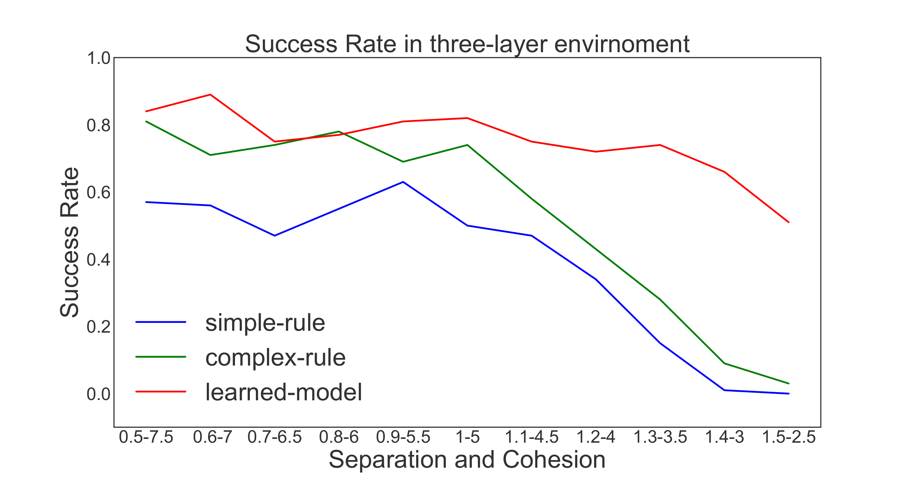  
    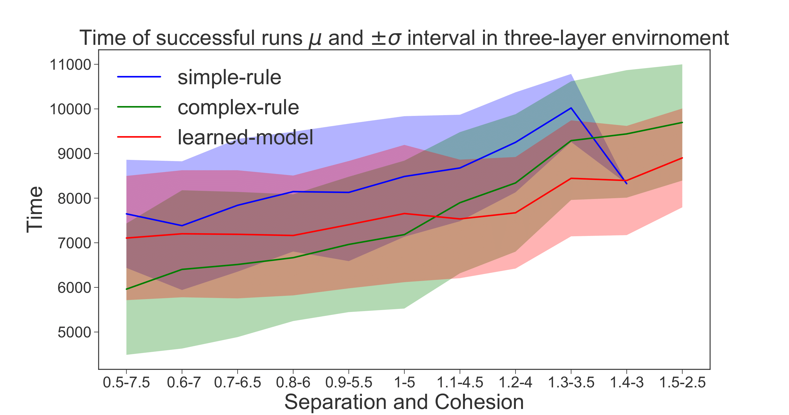 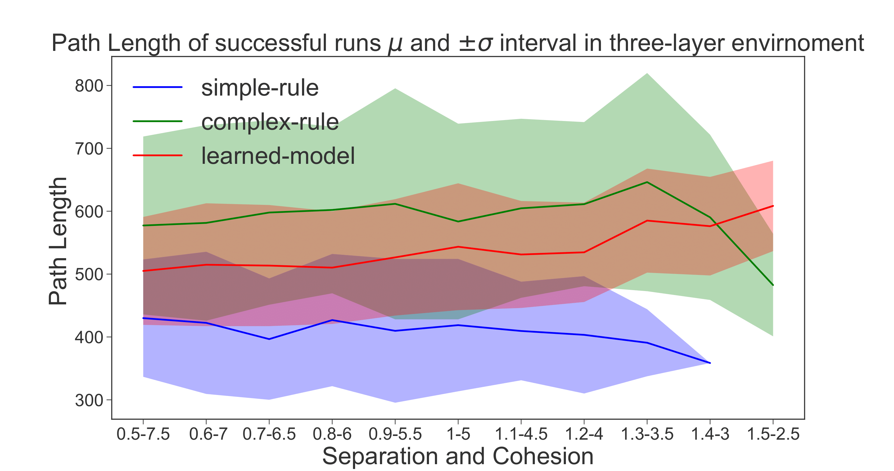
    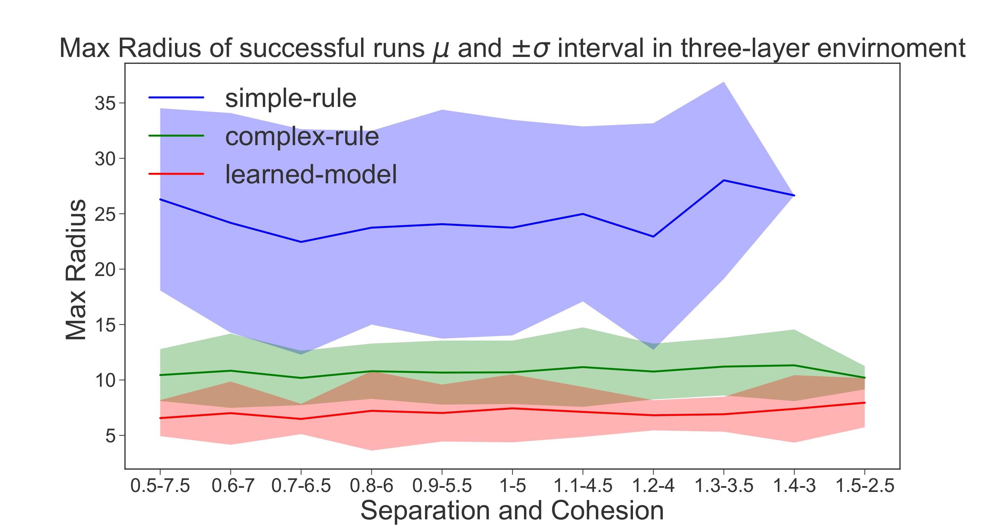 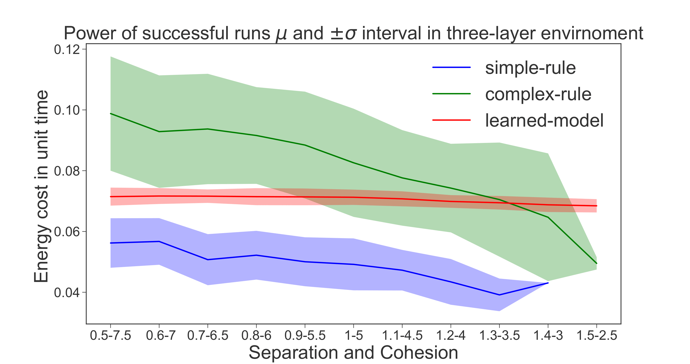  
+ **Infographics:**  
  + Workflow: Potential field optimization → DRL training with pixel-blob observation.  
  + Comparison of rule-based vs. surrogate-guided herding.  

**5. Significance & Impact**  
+ **Key Contributions:**  
  + First method to herd 7–8 agents in obstacle-filled environments using DRL.
  + Pixel-blob group representation improves deformable flock modeling.
  + 65–85% success rates in noisy settings, 10–20% higher than rule-based methods.  
+ **Applications:** Swarm robotics, UAV coordination, livestock management.  

**6. Download & Citation**  
+ **Download:** IEEE Xplore (10.1109/IROS47612.2022.9982269) 
  - [IEEE Version](https://ieeexplore.ieee.org/document/9982269)
+ **Cite (IEEE):**
Jixuan Zhi, and Jyh-Ming Lien. "Learning to Herd Amongst Obstacles from an Optimized Surrogate." In 2022 IEEE/RSJ International Conference on Intelligent Robots and Systems (IROS), pp. 2954-2961. IEEE, 2022.  

**7. Media Kit**  
+ **Video Abstract:** Create a 1-minute video showing:
  + Flock navigation through lattice/pachinko environments using the potential field.  
  + Side-by-side comparison with rule-based methods (highlighting success rate gaps).
    

**8. Testimonials**  
"Our method achieves 80% success rates in 3-layer obstacle environments—10% higher than rule-based baselines."

**9. Related Work & Code**  
+ Prior Research: [Herding with DRL and Probabilistic Roadmaps](https://jixuanzhi.github.io/publication/Shepherding%20with%20Deep%20Reinforcement%20Learning)
+ Code/Datasets: Mention availability upon request (Python/C++ implementation).  

**10. Press Coverage**  
The paper is presented at IROS 2022, Kyoto, Japan (Online).  
[IROS 2022 Presentation Talk](https://jixuanzhi.github.io/talks/PF)

