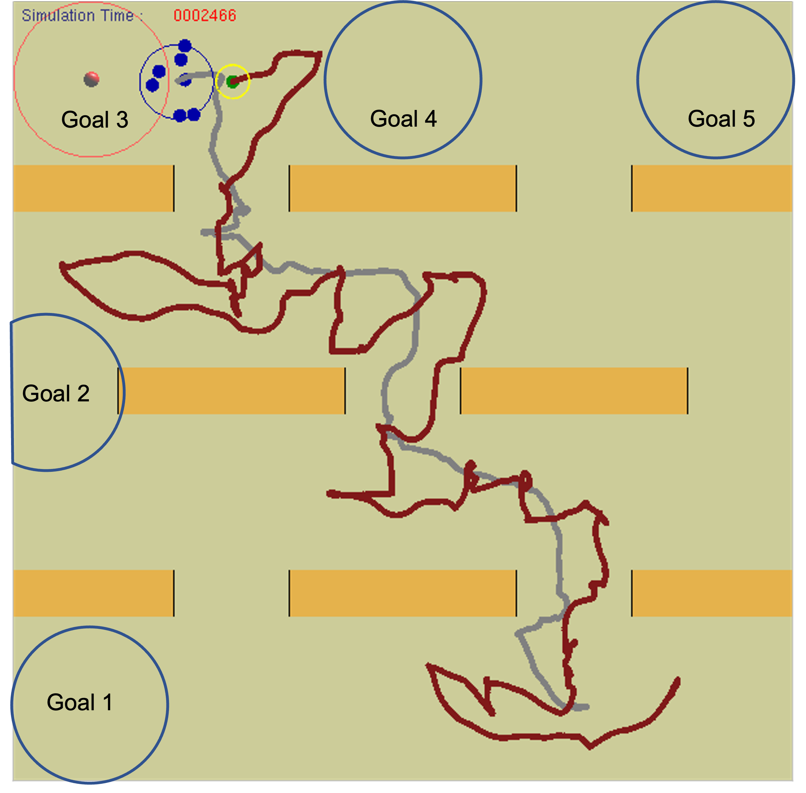

**1. Title & Authors**  
**Title:** Learning to Herd Amongst Obstacles from an Optimized Surrogate  
**Authors:** Jixuan Zhi, Jyh-Ming Lien (George Mason University)  
**Affiliations:** George Mason University 
**Contact:** jzhi@gmu.edu, zhijixuan@gmail.com

**2. Abstract**  
We propose a deep reinforcement learning (DRL) framework guided by an optimized potential field surrogate to herd large groups (7–8 agents) in obstacle-cluttered environments. Our pixel-blob group representation and surrogate-driven training achieve 65–85% success rates, outperforming rule-based methods. The approach is robust to behavioral noise and environmental uncertainty, with 10–20% higher success rates than prior learning-based methods.

**3. Layman’s Summary**  
Imagine a robot sheepdog trained by AI to herd a large flock through a maze. Instead of rigid rules, the robot uses an invisible ‘force field’ to guide sheep smoothly around obstacles. Even if the flock scatters or the maze changes, the AI adapts, keeping the herd together and moving efficiently!

**4. Key Visuals**  
+ **Figures to Highlight:**  
  + Figure 1: Overview of the optimized potential field and pixel-blob group representation.  
    
    > **Figure 1:** An overview of the proposed method. Given an environment filled with obstacles and a group of agents, our approach generates an optimal potential field, which is used as a surrogate to train an optimal herding policy.    
  + Figure 3–4: Fixed (lattice, pachinko) and perturbed (U-turn, gap) obstacle environments.  
     
    > **Figure 3:** The two fixed obstacles environments. Left: lattice environment and two paths generated by the proposed method, red: shepherd path, grey:  sheep center path.
Right: pachinko environment.
    
     
    > **Figure 4:** The positions and orientations of the fences are perturbed to form 3 layers obstacles during training and testing.  
  + Figures 5–10: Performance charts (success rates, completion time, energy cost).  
     
    > **Figure 5:** Success rates of herding 7 sheep in lattice environments (left) and pachinko environments (right)  with different goal areas.  
    
     
    > **Figure 6:** Success rate of herding 7 (left) and 8 (right) sheep in different  three-layer obstacles.  
    
    
    > **Figure 7:** Success rates for 3 sheep in a three-layer environment with different degrees of Fear Force. The X-axis represents fear force coefficients.
    
     
    > **Figure 8:** Success rates for 8 sheep in a three-layer environment under different degrees of alignment (left) and separation and cohesion (right). The X-axis represents alignment coefficients (left) and the pair of separation coefficients and cohesion coefficients (right) .
    
     
    > **Figure 9:** Completion time (left) and Path Length (right) of success tests for 8 sheep under different degrees of separation and cohesion in a three-layer scenario. 
    
     
    > **Figure 10:** Maximum radius (left) and Energy cost in unit time (right) of success tests for 8 sheep under different degrees of separation and cohesion in a three-layer scenario.  
+ **Infographics:**  
  + Workflow: Potential field optimization → DRL training with pixel-blob observation.  
  + Comparison of rule-based vs. surrogate-guided herding.  

**5. Significance & Impact**  
+ **Key Contributions:**  
  + First method to herd 7–8 agents in obstacle-filled environments using DRL.
  + Pixel-blob group representation improves deformable flock modeling.
  + 65–85% success rates in noisy settings, 10–20% higher than rule-based methods.  
+ **Applications:** Swarm robotics, UAV coordination, livestock management.  

**6. Download & Citation**  
+ **Download:** IEEE Xplore (10.1109/IROS47612.2022.9982269) 
  - [IEEE Version](https://ieeexplore.ieee.org/document/9982269)
  - [Pre-Print Version](../files/Pre-Herd-PF.pdf)
+ **Cite (IEEE):**
Jixuan Zhi, and Jyh-Ming Lien. "Learning to Herd Amongst Obstacles from an Optimized Surrogate." In 2022 IEEE/RSJ International Conference on Intelligent Robots and Systems (IROS), pp. 2954-2961. IEEE, 2022.  

**7. Media Kit**  
+ **Video Abstract:** Create a 1-minute video showing:
  + Flock navigation through lattice/pachinko environments using the potential field.  
  + Side-by-side comparison with rule-based methods (highlighting success rate gaps).
    

**8. Testimonials**  
"Our method achieves 80% success rates in 3-layer obstacle environments—10% higher than rule-based baselines."

**9. Related Work & Code**  
+ Prior Research: [Herding with DRL and Probabilistic Roadmaps](https://jixuanzhi.github.io/publication/Shepherding%20with%20Deep%20Reinforcement%20Learning)
+ Code/Datasets: Mention availability upon request (Python/C++ implementation).  

**10. Press Coverage**  
The paper is presented at IROS 2022, Kyoto, Japan (Online).  
[IROS 2022 Presentation Talk](https://jixuanzhi.github.io/talks/PF)

