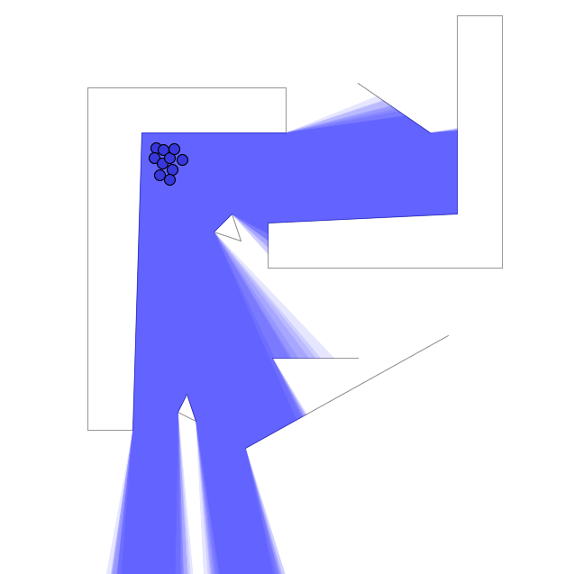

**1. Title & Authors**  
**Title:** Computing 3-D From-Region Visibility Using Visibility Integrity  
**Authors:**  
  Jixuan Zhi, Yue Hao, Jyh-Ming Lien (George Mason University)  
  Christopher Vo (Sentinel Robotics, Inc. & AES Corporation)  
  Marco Morales (Instituto Tecnológico Autónomo de México)  
**Affiliations:** George Mason University, Sentinel Robotics, Instituto Tecnológico Autónomo de México.  
**Contact:** jzhi@gmu.edu, jmlien@gmu.edu.

**2. Abstract**  
Visibility integrity (VI) is a measurement of similarity between the visibilities of regions. We present a method that speeds up VI computation from O(n^4logn) to O(n^2) and introduce the visibility-integrity roadmap (VIR), a data structure for 3-D group visibility and planning. We demonstrate applications in group tracking, such as camera motion planning to maintain visibility of moving targets in 3-D environments.

**3. Layman’s Summary**  
Imagine a camera tracking a swarm of drones in a cluttered 3D space. Our method helps the camera ‘lazily’ follow the group by precomputing visibility zones (VIRs) offline. This reduces computation time drastically and ensures the camera moves efficiently while keeping most targets in view.

**4. Key Visuals**
+ **Figures to Highlight:**
  + Figure 1: Visibility integrity values (high vs. low).  
     
    > **Figure 1:** A set of 10 points with high visibility integrity on the left and another set of 10 points in the same environment have low visibility integrity on the right. The lighter area means it is only visible from a few points.
  + Figure 2: Visibility-integrity regions in 3D environments (grid-based vs. kernel-based)  
       
    
  > **Figure 2:** The visibility integrity regions in three different environments. (a) Grid-based visibility integrity region computed by naive method. (b) Sampling-based visibility region computed by naive method.
(c) Convex hulls of the clusters acquired by applying the kernel-based method on sampled points. In all figures, each visibility integrity region has a visibility integrity of 0.5.
  + Figure 4: Simulation environments (tower, pachinko, ruins, canyon).  
       
    
  > **Figure 4:** Images of the four 3D environments for the kernel-based offline experiments. From left to right: tower, pachinko, ruins, canyon. In all environments, all targets are in red, the camera is in dark blue, and the random goal is in sky blue.
+ **Infographics**:  VI workflow (sampling → clustering → VIR construction → planning).

**5. Significance & Impact**
+ **Key Contributions:**
  + Reduces VI computation time from O(n^4logn) to O(n^2)
  + First offline method to compute VIRs in 3D for real-time group tracking.
  + "Lazy" camera motion: 50–80% less movement than baseline methods.
+ **Applications:** Robotics, UAV surveillance, deformable/articulated object tracking.

**6. Download & Citation**  
  + **Download:** IEEE Xplore (DOI: 10.1109/LRA.2019.2931280)
    - [IEEE Version](https://ieeexplore.ieee.org/document/8772150)
    - [Pre-Print Version](../files/Pre-VIR.pdf)
  + **Cite (IEEE):**
  Jixuan Zhi, Yue Hao, Christopher Vo, Marco Morales, and Jyh-Ming Lien. "Computing 3-d from-region visibility using visibility integrity." IEEE Robotics and Automation Letters 4, no. 4 (2019): 4286-4291.

**7. Media Kit**  
  + **Video Abstract:**  
    + 3D simulations (e.g., camera tracking targets in the "canyon" environment).  
    + Comparison of VIR vs. reactive/IO methods (visible ratio and camera path).  
    

**8. Testimonials**  
"The VIR method achieves 80% visibility with 60% less movement than reactive methods."  

**9. Related Work & Code**  
  + **Prior Research:** Jyh-Ming Lien and Young J. Kim. "Follow moving things in virtual world." In Proceedings of HCI Korea, pp. 69-73. 2016. (previous VIR work).  
  + **Code/Datasets:** C++ code avaliable upon request  

**10. Press Coverage**  
The paper is presented at IROS 2019, Macao, China (Onsite).  

